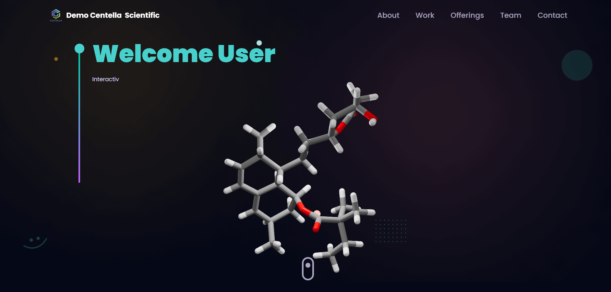

<div align="center">

  <div>
    
    
    
  </div>

  <h3 align="center">A Demo Centella Scientific Website </h3>

 
</div>

## 📋 <a name="table">Table of Contents</a>

1. 🤖 [Introduction](#introduction)
2. ⚙️ [Tech Stack](#tech-stack)
3. 🔋 [Features](#features)
4. 🤸 [Quick Start](#quick-start)
5. 🕸️ [Snippets](#snippets)


## Live Demo

Check out the live demo: [Demo Centella Scientific](https://vvslaxman.github.io/demo-centella-scientific/)


## <a name="introduction">🤖 Introduction</a>

By developing this project, you will gain hands-on experience in crafting immersive web experiences, mastering 3D libraries, and implementing engaging animations. The combination of creativity and technical skills showcased in this project serves as an excellent learning opportunity for developers seeking to enhance their own websites and captivate users with cutting-edge web design.


## <a name="tech-stack">⚙️ Tech Stack</a>

- React.js
- Three.js
- React Three Fiber
- React Three Drei
- Email JS
- Vite
- Tailwind CSS

## <a name="features">🔋 Features</a>

👉 **Customizable 3D Hero Section**: Includes a 3D desktop model easily customizable to suit specific needs.

👉 **Interactive Experience and Work Sections**: Utilizes animations powered by framer motion for engaging user experience.

👉 **3D Skills Section**: Showcases skills using 3D geometries through three.js and React Three fiber

👉 **Animated Projects and Testimonials**: Features animated sections using framer motion for projects and client testimonials.

👉 **Contact Section with 3D Earth Model**:Integrates a 3D earth model with email functionality powered by emailjs.

👉 **3D Stars**: Generate stars progressively at random positions using Three.js for background display.

👉 **Consistent Animations**: Implements cohesive animations throughout the website using framer motion.

👉 **Responsive Design**: Ensures optimal display and functionality across all devices.

and many more, including code architecture and reusability 

## <a name="quick-start">🤸 Quick Start</a>

Follow these steps to set up the project locally on your machine.

**Prerequisites**

Make sure you have the following installed on your machine:

- [Git](https://git-scm.com/)
- [Node.js](https://nodejs.org/en)
- [npm](https://www.npmjs.com/) (Node Package Manager)

**Installation**

Install the project dependencies using npm:

```bash
npm install
```

**Set Up Environment Variables**

Create a new file named `.env` in the root of your project and add the following content:

```env
REACT_APP_EMAILJS_USERID=your_emailjs_user_id
REACT_APP_EMAILJS_TEMPLATEID=your_emailjs_template_id
REACT_APP_EMAILJS_RECEIVERID=your_emailjs_receiver_id
```

Replace the placeholder values with your actual EmailJS credentials. You can obtain these credentials by signing up on the [EmailJS website](https://www.emailjs.com/).

**Running the Project**

```bash
npm run dev
```

Open [http://localhost:5173](http://localhost:5173) in your browser to view the project.

## <a name="snippets">🕸️ Snippets</a>

<details>
<summary><code>constants.js</code></summary>

```javascript
import {
  about3,
  about2,
  about1,
  ball3,
  ball6,
  ball4,
  

  ball2,
  ball5,
  four,
  one,
  two,
  three,
  five,
  comm,
  academy,
  ball1
} from "../assets";


export const navLinks = [
  {
    id: "about",
    title: "About",
  },
  {
    id: "work",
    title: "Work",
  },
  {
    id : "offerings",
    title:"Offerings",
  },
  {
    id : "team",
    title:"Team",
  },
  {
    id: "contact",
    title: "Contact",
  },
  
];

const about = [

  {
    title: "50+ Patents & Book Chapters",
    icon: about3,
  },
  {
    title: "200+ International Publications",
    icon: about2,
  },
  {
    title: "60+ Years of Cummulative Experiences",
    icon: about1,
  },
];

const perks = [
  {
    name: "Unparalleld scientific expertise",
    icon: ball1,
    
  },
  {
    name: "Interactive & Proven processes",
    icon: ball2,
  },
  {
    name: "On-time delivery",
    icon: ball3,
  },

  
  {
    name: "Assured confidentiality",
    icon: ball4,
  },
  

  {
    name: "Value addition",
    icon: ball5,
  },
  {
    name: "Quick turnaround",
    icon: ball6,
  
  },
];

const works = [
  {
    title: "Submit",
    icon: one,
    iconBg: "#383E56",
    date: "Step-1",
    points: [
      "Describe your specific need and choose the service you avail.",
    ],
  },
  {
    title: "Evaluation",
    icon: two,
    iconBg: "#383E56",
    date: "Step-2",
    points: [
      "Our experts critically evaluate & edit the document as requested",
    ],
  },
  {
    title: "QC Check",
    icon: three,
    iconBg: "#383E56",
    date: "Step-3",
    points: [
      "Two-tier stringent quality check",
    ],
  },
  {
    title: "Update",
    icon: four,
    iconBg: "#383E56",
    date: "Step-4",
    points: [
      "Edited files will be shared & feedback sought",
    ],
  },
  {
    title: "Approve",
    icon: five,
    iconBg: "#383E56",
    date: "Step-5",
    points: [
      "Verify the document in entirety and submit to author",
    ],
  },
];

const team = [
  {
    name: "Dr. Riyaz Syed",
    designation: "Chief Scientist",
    image: "https://media.licdn.com/dms/image/D5603AQGL2xGU6s9GSw/profile-displayphoto-shrink_400_400/0/1701757919492?e=1715212800&v=beta&t=tQN409r241ZvNpLy2Sz1bDkoUZeVTr27z169vuXXREs",
  },
  {
    name: "Mrs.Teja Arigela",
    designation: "Head - Scientific Communications",
    image: "https://encrypted-tbn0.gstatic.com/images?q=tbn:ANd9GcQPkZwrekZHgbscp3PJhKPyik0I3tG0c3DJA6ZBscI1cH-mNOU0SOsnZ_WlvoeUtWS-4LU&usqp=CAU",
  },
  {
    name: "Dr.Poornachandra Yedla",
    designation: "Head-Molecular Biology & Co-Founder",
    image: "data:image/jpeg;base64,/9j/4AAQSkZJRgABAQAAAQABAAD/2wCEAAoHCBUVFRgSFRUYGRgYGB4YGBgYGBgYGBoYGBoaGhgZGhwcIS4lHCErHxoZJjgmKy8xNTU1GiQ7QDszPy40NTEBDAwMEA8QHhISHjQkJSQ0NDQ0MTQxNDQ0MTQ0NDQ0NDQ0NDE0NDQxNDQ0NDQ0NDQ0MTQ0NDQ0NDQ0NDQ0NDQ0NP/AABEIANIA8AMBIgACEQEDEQH/xAAcAAABBAMBAAAAAAAAAAAAAAAAAQIFBgMEBwj/xAA+EAACAQIEAwYEBAQFAwUAAAABAgADEQQSITEFQVEGByJhcZETMoGhQrHB0RRSYpIjcoLh8DPC8RUkNFOi/8QAGAEBAQEBAQAAAAAAAAAAAAAAAAECAwT/xAAkEQEBAQEAAgICAQUBAAAAAAAAAQIRAyESMUFRIgQyQmHwE//aAAwDAQACEQMRAD8A6aBDLFWEBMsMsWEBMsMsWEBMsQxSYyARKtUIpd2CqBckmwAEqPbjtomBApqpas63UfgUXtdjf7CcU4rx3EYhmerVZi24ucu+gVdlHpLwdwx3eRgKWnxWc9ERiD9SLSm8U7367ApQoqnRyxZrX00tYaTmVJRfxe03cXhl0anfzBsdfYSyInMd3icRqC38Qydcll++8h8V2ixdTV8TWY+dR7e15oVFa/iUg+lo4UL6XsfPSFSOE7TYmnqtZz/mdm+xMmqHeFiwAFtcDWzOL28ryrfw7Low0Ive1/ymehhzYGwIB+v7yydReuG96uIX5wSPM5h6XOssWB716LWFVGUc2QEgeq2uJyqsq3zJoQNQ3PyvGUkptowyNblcA+e+kvxTr0TwzjtDEKHpVAwO3KSF55rwFapQqBkcrY78j5GdX4d3j4cKortlbY6E69dOUzcr1fI6VfBdusDV0WuoJ5N4T7GTaY9GAKupB2sRJxW7YRcsxq948GQLlhlgDFgJlhliwgJlha0WBgCwgsIBCEIBAwiNAaTNLi3EUw9J69Q2VBc/oB5mbk4t3q9oHeucIrEU0sSoOjN1PWWCndouMPi671356KOiAnKPvNEUyoze0ZaZaw8NyfICUYSfrN3CMDoCFPUmw9jpI6bFCi7fKCfSIJI5Do6nNyZSR+VwftGmnddQzAbXIRh/doZgorcbkEfNzmymIsWViLW8OpKnpra4+s0hqVFChTYEfzAj7jSPqYtrAKEYdFAJmCqrAE8h6TVuP+fpL0bS4skkMLfaadXyJ9D/AM1gXNtTcRq3vpvM2nAlUjnHVql7HqNfXb9IlSmb7EXjCD02k6vCUxciWnhXE3pqFRyBzIO/05CVdGm7h32sdTuNfzliVfqfaqrQXOtUkg6rfS3ownSezHGhiqCVsuUkeIbi/UThNfEKbU3HiNvEhBBB29TOqd19UCi9ENmCZXU/yh83h1HUE/WTUIvgMcIwR4mVEIQgEDCBgCwgsIBCEIBGtHGNaAx2sCfKeae0+LL4uq7G5z29p6RxmbI+T5sjZfWxtPLuNa9Rz/UfzlgdVxBIsQDpvbWa14t9LSV4Z2fxFezJTOU/iNgPpeLefa5zbeRFIhJsBeW3gnZ6o6glSt99Df630+0t3ZzsUtEXchmO5t9h5S54bCKmwnK+X9PTnwcndOeUexZGo0PneYsT2S/CCAd7WNvUW1nUsg6TG2EVtx+8k3Wr48uP4jsi6m4cNbbKPsesw0OyFZmI0ta40PXSdmTAKP8Axr7xy4ZRsJflU/8APNcswHYIkHOdb6EXGn/mWbD9kaYynIAw3Ntzz0lvsByjSZm6rpnGZ9RUsf2YRkIsL7jQWv5ic+7Q4NabWZSp8vL9xO0VDeV3tFwNcSjJs3I8wRtLnfL7PJ4Zc+nGHpAc7+n6xUFuev1mTiOCq0HNOoCpB+hA5iawqnrO8seCyxndSxuT6mdW7nlP+O2uWyD63b6TlmCRqjimPxH3noDsTwIYTDKl7s/jc+ZGijyAiiwzIIwR4mQQhCAQMIGALCCwgEIQgBjWjjGtAxVlupHUEe4nlziVIpVqIRYq7A/RjPUGJxCohdjYD/lpwTvGwp/i2xAQqlazD/MAA3lfS/1jq/G861uxvAf4moWb5EIv5sdh6dZ1rC4VECqoAsLC0rXd7g8mGVrfOxf9B9hLDic9wBoOZnDd7rj3+HMzj5c9pSkRfcTcpoDK8K1NPnqqvXM4W3vMVTitG/gxuHJ/lNVL/nEzE1urYKcPhSt0OLODqcw/mUhhb1ElsLxEPswMvpnlSGWNKRyPeYK9fLvKk6yimIx1UcxIfF8WA8I1PlNKnme7PUCA+Z/OORrukviKqDmL9JpjEq2x9RzmNf4cafGBPPxAzWqYam3iQi/Jgf20iyNZ1pFdsOEpXoMSPGql1b+oDb0M47PQDUrpY8xYziPFcAUxD0FGz5Vv5nw/SxE3j6efz59yxZO6zhgrY0MSQtNC5At4idAD5ftO8gTnvdr2cGGZ3a7VSoDEfKAbHKt9/WdCmu9cLLPs5RHRBFhBCEIBAwgYAsILCAQhCARGixGgRvHaIei6nYjUTn/a7Aq2CawuQFZF3s3Vehtf3nScZSzoy9Rp68pTeKYcGmUOgUi1+Q8Wh9zOO+/KV7PBZcXNZuz+HCUkQCwCKPYCSPEcMrrYaHqJpcKfQfSSu8xqe3fN5Iq+D4IiVPiMoc72cZlv1sdL+cx43szUeq9WniVRXcO9N6aVBmUZRq3K3LaWs0gY5MMOg9pc2xnec37iHp8HRKaU0AUoNWXw5idSSoFgPTaZKeDCa85MFABNCrUBOm0avVxJPpI4V9Jg4gmYWmbDLpMWIMv4Y5/JA1OF3J1sPPf2On5zS47wV3KmgUPyhkrj4i+BgwKlvlvbW1ry10UDCD4QdJZeGpL6qAwnCkSgadWnRLlme6IFVC5vamN1t67xeFcHVNczEXvrr9+cmjhhMiIBFtrWZMz0ZWpi20pVPgyNxMuyhgKOcA7BwwVT7Xl4xB0ldX/5Nxvk+wOs1L6rNnbOrHwQAl287e2kmBIzglOyE9T/AL/rJQTU+nk8t7qnCEBCacxCEIBAwgYAsILCAQhCAQMIGAwyp9s8K4pu6fiA+hXX7gS2kSO41hmdMijci9ukzqem/Hqy+lP4HicyI3UA/aWCk+kr3DKRS6EWysVtsbA6Sdpzjr7e7H03EM2EM06bTI9cDeXKajHjizaDbnNOriqSWzuqnoWAMZiOLA3VNTe3Oawwzvq4A9bX+8XP7XN9ciw0cUhFwwt6iar4ykWy51v0uJrU8GltVU/6hMFbAa3Cr5fKZT42VvI9nuu3O0k0NxK8nEPh6OgA6yUw2ORgLHflLyxm2VtuswtMme8wuZFjXxDaStK//uv9H6iT+LbQzS4RwlqjmqdvlBv03sJvM9Mb1JZ1asHTCooHT7nUzZWMQWFpkE28dvaIQhCCEIQCBhAwBYQWEAhCEAhCEAMYY8xpgVbjtDJVFQDR9/UTLhtRJriGEFVGQ8xoeh5GVrCVCjGm+jLv5+YnPc/L1eDf+KUVZH18OzG3Xzm4tSOV7G85Zr06iBfhVVWurqvSyEn3J/SZKXDhfx1GvzJNpYaZB3hiMMjbia91M6mfXEQuAQbVT/eIPw4cqp/umWrwam34PqY/DcKRDtHG/n/pHYjA1CMquGH9YzflMmGwTqPEBf8ApJt99pYAigaCYXqAaTUtjjeW/RmHvbWOeMNW018RigAbyNNfGvyG50+vKWHhmF+HTVDuBc+p1Mh+C4Q1W+Ow8KnwDqR+L0EsM6ycePy6+V5DxFgISuQhCEAhCEAgYQMAWERTFvAIRpaGaA68TNG3iQHExsjOK9ocLhgTXxCIQL5cwLm3RFux9pTeId7WFW4o0alQ8i1kX8y32gXbjXF6WFpNXrNlVeXNjyVRzJnOuDYjEY01uIsxRGcJRTcBVvcf853lA7Sdo6+OqfErMLAEIi6Ig6AdfPcztvZDhyNwzDUwAM1JX/1t4r+5k19N+O81LUQnF7HIwyt0O30POKeI3Gh9dbzcxnDVcGm66jccvUH9ZVeI8JrUv+m2db/K97jyDDl63nHNz3le7U1zs9xaMBxddBff95MJjFPOcmaliR4gpXn4T76HePXi+JFxqB5ob+4M62Z/Fc5dfmOuLXU8xFaqOs5WnHcQul03/lfaZm49iSNFUknT5gLCT4z9r2/p0PEY9RpfWRh4kuvUSjVMdimvdQB/Tzv56mbOC4bWc2uVvuTqbfv5y8zPyn8vwtD8VW29z0G/sJDdp3xD0StO6szWRQfE1rsdeXhUyb4fwtKS6am2rHVj6mSXBOFl6wxLnwIrKi23dtGf0C3A/wAxkl7r0eT+ObbUZ3adqxiqP8PUIFekANTq6AWDjzGxHoecvE8y48thsXUyEo1Ks+RhoRlY2+06x2U7zaFVFp4xhSqjTPlPw26G4vlPW9h5zo8TogMdea2GxSVFz03R1P4kZWHuDMsgyXhGXi5oDoRM0M0BYGF4GBjhKjxPvJ4fTuFqNVI5U0JB/wBTWX7yo8Q73apuKGHROjVGZz/atgPcy8HXQJGcT4/hcP8A9bEU0I/CXBfT+geL7Tg3FO2eOxF8+JcKfwofhr6WS1/qTK+zEm51J1JO9/OODsvFu9rDoSuHovVI2ZzkQ+Y0LH2EoXGu8DHYi6mr8NDcZKQyaHkW+Y+8qt40y8CsSTc84ojRHXgLPRPdxiRU4dhyPwoUPqjFf0nnYTr3crxO6VsKx+VhUUf0towH1AP1ko6Ri8Ir+RGxkJisKRo49DyliMa6BhYi485z1iadvH5tZ9fcU2pgh0/b/aYv4LyH5yy4jhxGqajp+00/gqeVj7Tjc6z9vZneNT0iDhEO4ExNg15LJz4KxppKNhf1iWtekKnDQTe0kqNFUGk2Cv09JIYTAbM49B+81JdMa3nM61sJgC/ia4T7t+wk5TQAAAWA2AiCYcbi0o03rObIil2PkovO0zx4d7ur2vOHbBw2OxRG3x3+zESGmfG1/iVHqH8bs/8AcxP6zBN8YZ8HjalFg9J2Rh+JGKn7S4cL7zsfSsHZKy31DqA1ugZbe5vKOwiQOyYDveoG3xsO6HmUZXHscplmwPb3h1UaYlEPSoGT7sLfeedrwvJweqcNikqLmpujr1Rgw9wZlnljDYp6ZzU6joeqMyn3Blm4V3hcQoW/xvirtlrDP/8Aq4b7xwegY5d5yjAd8GoFfC6c2pPr9FYf90unAu3OAxDKi1wjtslQGmbnkCfCfoZB52iRYs2hkUxTEMBkQxTCSqEixVGkVoiGgyzdhOImhi0cGwY5T5gnaVkTcwFbJUR/5XUn0BESD1CrhgCNjqISK7O4jPSAve2x6qdRJWZUTDXwyt5HqJmmhxXiS0VtbM5+VBufOw5eclk/K5tl9NarQdTa1/T9o9MG53IEgf8A1KoGLM9zcAppcE6nfXTpcW85ophqhr/xVOs6OU2LlkOuoKWI5WI01G+t5zkz167d/H8L1h8Kqa7nqf06TPIfs9x9MSrAWWohKumYEgg2uLbi/P6SYnSc/Dy6tt9iUPvd4uKeEGHB8dZhcc8iG7H3sPrL8BOB95nFBiMa+U3WmoRfUasfqT9prMZUxokc0bNAMbHRLSUJHARLRRAWJCEcC3iQhHBkhAQMqEJjYhgphSmJHExF3gOEWBgohDbR6tEMFgdp7q+IZ6KoTcrdDrfbVfsbfSdCM4P3bcVFHEhWICuANds1/D+onerSUjWxuKWkj1HNlRSx+k5/wTEnFu+MqC+ayqmrKgUtbQeX4r21PSWbtbhvjUjTN7DXTmQNL9ZSezByZsO4/GXTfcWY2tz0G9xpOeux28fL1OU6wGxVlYqzl7ALbQAA2DKAPmG45mZzTKpYWLOxGgNiWNhlOYHTTkARNfOQPhh/wsM99LHUEeK4Ynb8gJIcPT/ForcWXllUEFUPTUa20685jM9vR5bzPqof4L4Wp8RPmvcnk19wfWXzA4kVEWouzD2PMTV4tgFdDpr/ALiQ3AcX8HEPhn2Y+E9Gt+onWzn08fep3juOXD4epWY2CobepFh955nr1CzFjuxvf1nYu+HiYWkmFDas2dx/SPlv9fynGahm5ORljJiQhCiEIhkoUQEIpEcCQi3hKEhARTAfEYQvCEIRGGZCIwiSqdaLGqYsqFydIC8W8QmAoMW8QCKRAyUXykN0no3sxxf+IwyVG0fKARzOgs3od55unbu6nG/Fwyg/NTY0z6AAr9iIs6Lbj6d1PnKeOFC7ORsSR9ADpL5ikuplI7WYzJh3RSA7E6kXWwBJzaiw03F5z1ex0xPZ6j4i5QXYDJcWFjbKVU30IsNcwI15kR+AqlcRTZn8Ja1iBpmBUDQ3IvaxN9LW3M0+FUilIFTr4fAtix1LEgsDpdjcWtcjUCb2OojKCrC4cMGA1NmDaa2yg6EDax1mM/b075cxbao3/wCc5Te09PJUNUGzA3v0K7S4U6odA67MAfec37xuIZM6g6i4H10E733l4p6qg9ruNNisS9Vv6UH+hQp25XufrIFopjTAaBC0W8bCltFAgBFhAZjMexjQIUQhCAoiRRCAExQI2PEILQMWIYDBvHRrR94BEtAGLAdC0S8UQEJnRu5viWXEvhjtUXOv+ZN/cH7TnMmuxeP+BjsPUJsBUCt0yt4Df+6B6OxtQIpY6AAk/Scs425q1KeVGN2Lvo/LYEbEZCTpqQNJdO8DHGjQUf8A2OE5/LYljp5Ays4pDZFZVzgL4dgmU2JXwkAALsDvcec5aejxTk7+/TawQIXxJmUrtlFhYgrmZgApFzrrcm1yRN6ojOjcgSzZDbxaXXNl0A2APMAHS8wYeozEIp3uG0vqgDBdDewPO4Py9ZuqWUFCSdSuwGmVbZhr4ddLWOUakzE512134m9msbkZqLIUTUjMAtnvcroTqbE2vccwLzlPeDxFqmMrJfwq+nsP1nSuJA0UNVmFspcnIQQSFJY+MC5NrgWGhPKcRxeJao71GNyzFj9TOub2ceby5+Ou/tjjTFvGzbkLRIohAUQMVREMBpgIkIUQhFtAUQMIQhscIQgK0Q8oQgJBYQj8qIsIQgMdyhCANGtzhCB27vVc/wALgNTqy313vT1v1iduWKNTyHLp+Hw7ZOkITh5Pp7f6b7iRoaihfXxBddfDlXT08pu0dBYaA1cpA0utjoeo8oQmc/btv+3/AL9q92gYjDkg2Jo12J6sqNlPqOR5Ti/IQhOnjeb+p+4aIQhOrykEcIQgOMYYQgNiwhCiJCEBViwhJUf/2Q==",
  },
  {
    name: "Mr.Yugandhar Dodda",
    designation: "Chief Operating Officer",
    image: "data:image/jpeg;base64,/9j/4AAQSkZJRgABAQAAAQABAAD/2wCEAAoHCBUVFRgWFRUYGBgYGhoZGhgcGhgaHBoYGhgaGhoaGhocIS4lHB4rIRoaJjgmKy8xNTU1GiQ7QDs0Py40NTEBDAwMEA8QHxISHzYrJSs0NDQ0NDQ0NDQ2NDQ0NDQ0NDQ0NDQ0NDQ0NDQ0NDQ0NDQ0NDQ0NDQ0NDQ0NDQ0NDQ0NP/AABEIAM0A9gMBIgACEQEDEQH/xAAcAAABBQEBAQAAAAAAAAAAAAADAQIEBQYHAAj/xAA7EAACAQIDBgMGBQQBBAMAAAABAgADEQQhMQUSQVFhcQaBkRMiMqGxwUJS0eHwBxRiciMVM5LxJIKy/8QAGwEAAQUBAQAAAAAAAAAAAAAAAwABAgQFBgf/xAAuEQACAgEDBAIBAwMFAQAAAAAAAQIRAxIhMQQFQVETIjJhcYEUkbEVIzOh0Qb/2gAMAwEAAhEDEQA/AOnYv4T2nOseffb/AGM6Li/hPYznOMzdu5+sv9u5Zgd48AI60QLHhZrowGxlooEeEi7kVDahlooEfaNasFBJW54A6dyYHPmjijbLHTdPPqJ6Yo8KZOdwBzOn7yI+Nw6E23qjdALeV9JW43HGo1i2+fyjJR+sC+KRB7zWPID7zHy9VPK/SOq6TtmLArluydiNpu97UrDqbfT9ZE/uHIJuq24XN/raV2I2mG0JtwytIjYhTnZu9jceVpGMUi65eiwrV24/IX+ch1MVzY/+A/lpFqO3BvUWPpIj1X6GOxk2WDV1/P8AIr8rwRdeDmV71WOoiqPKDZJSLBTbgD8vpaLv/wCy+d/rK8o2oJ7iGSswyOf85RULUTVrt/ie4AMU1TxUdxaR0qg6i30hCZJIWoPTrW/Fbv8ArLTCY914+YP8EoN8Hj62MVQeDEeeXpJxk48AskIzVSSZs6O0g1r5N6SypYi+UwKV3FrcOIN/lLfAbSOQPpCrM3+RkdV2qMo3j2/Q1haMaCo1oZmHOKVM5yeOWOWloGIs9brPWlWaRFno5TG2jgtpWZEJPR6UiZ6QtEtEvRvcb8J7TnWJX327mdFx/wAJnO62bN3+82u2rk3u9PdDFEcBPCOAmsc+2KFjrRBHCoFBYkCwyvzg8uRY4OT8BMGJ5sigvLA4nELSF2tvcF+5lFUxPtCS9yOWY+kn4qghBdiTvZ3Y5+XKU1arbJSR6cOs5yeSWeWpnddL0sOmhpj/ACwWLrkD3FVBp187mQaety1/pePxVe34iT109JBeux1a0JGNBZSRKrVVHG/S17/zpaRv7jI2W3UyM7G97/zzjHqwiINj3xJ/n7wZq56esESDxjGY+nORkJEpal+H0jvd47w85HpVQCMh9uxktUDG6juv6dI0UJsZufke3Qwi73Fb9Rb6RPZHiBFC25iToVjCl9Lg+h/ePpudHF+uURqh5AxhrDisWyGDVVU8QR118jqIFKg0vn1I+s9v5ZE9jYxgAOq+YsIrHolM5GZXzGfziU8WBopB5waLl7pI+vyyjWBJ1PmPnIyEi+wG2DcBjcaZ8JrcJiEdQVIM5tQOZtp/M5b4HFMhDKcvxDgY8ZezO6/t8c8bjs0bc04gGcHgMSHXetY8R9xzEkImd5HLFVZyWSEscnGXKEtD0aXEwtGnJaUpnzdbBsOPVuwNoklmlFgbLvxs0W0D7jdpzx/iPedE2j8Ddpzqpqe5nR9t4ZZ71+SFBj1MEDFDTVMFoNB4pd0WbU2y49POFovZgSL24aSr2rVIYlszzGXr+0ye55pRhpS2fk3ex9NCc3OT3XCA4yqbG6+7bI5XPS3KZbE4o3O6CP0mjx7bwAuNL5/LtM5iUAvp/OsycErOqktiCWLHnzzziEW4/SOvfSw9c41rDl5GXUAY0A8D5XgWcDlG1HgXe+sZyoSQVqvlG2HWAuYTfJkLsVD1BhqYPp1jERuUssHhHbQH0/aNqSJqLYKkH4Z9wPrLTB7Lepov1/WW+ydgO5F1IHHnN5sfYoS1wAttOvWClnS4DRweWY/Z3gt3+I2Ha/1k7EeBkUXtc9gPpOhU0Aj3UQUskpeQihGPg4DtzZDUXtoOshUxfLUnkJ0/+oezg1PfAzXj06znGyQHqop1sfLIw+CepUAzQp2gFeg6rvLb+fz5GDcMRc8cpdYl0O8mhGduhF/ufWQ0Vbnlz5WJ/aWGgPALD0rel5MoJkb8QcpIw1Ibtz/BFNQX/nCNshbs0WwKZNO/5RYdhnLdYDYyr7EAefmJLCxSjcTiu6TT6h0OpPaT6LSDSt5yfQUSllhRDpm2+SQsWJPSo0zVTRebS+Bu051U1PczoW1Wsjdpz9tZ0nbV9WLvL+6BxwEUCLaahhtjlEjbY3GRd7scxfLlJMpPEaHdDHQcu4mf3GGrDwavZp6epSurAVcPvCy3udGJNgB14yoxNDPXTLj8pIbEMWQq27nu5HgddcpL27TKrvKBa3SxtOch9ZI7R8GWre6dB6yLUqX4R9YOc5HZTe0v6tiu4uwbtE9ZabP2QahzdEHMzYbK8FUMi1UP2yH7wUs0Y8hI4ZSMFhsOzmyIWPr9JqNi+Ea9ZhvLurx4To2zvD1BACBccuHnaXi7qLkAoHK0rT6hv8SzHBFc7mSwHgekmovNDhfD9FBYIP17xuI2wqaKWMgYjbFR1O4Ch58oJScuQtVwaWnh1UZACEFhxE569THObf3FvIfaLh8HiSfexHlZv1k1FeyL1M34xSfnH0jhiEOjD6yjwGzfzvv6ZafvLhKKINALchJqiDRH2thBUpsutwROIYjCvhsQzEEW3ra9bTvIxCnKV+1NhUMQtnQHkeOfWPCWmVoaS1RpnBKtdgd8nM2v2tb7wldiF6C+99pttr+Df7dGKguN7iLkAnhM/U2a4Zgq3Uki4zuBllLcZ6uCtKGkAuKuLcLfaJ7QG1uOveSE2LUIsVZSRlkc5HfZlalvs6MEUBiSDa2l4r9jUzb7Ca1JL6nXyylpviZPwhii6EcFNgek0hUyzqi47nDdzhXUyTZIBzllh5S7xhUrkaSDhCS5KuKWiVl9PSpXHMOU9APp1+he/q4ms2t8LdvtMC0322PgbsfpMCzZzU7d+LLnef8AkQ4CLEWLNIw2LIuPwS1UKtx4yVFAkZRUlTJ48koSUoumjHY7YdYAi1wDvKwta2nD5idP2fsqkuHo03QNuoM2zIJFznrImwkV3ZGFwRvDuLXmhrqCbjll9pyXcMTxZNPjlHf9s6n+pwqT54f7mM2rh8AlyVFlJBNsrjUXNgTeUOI2hg0JC0H0J/7fAam+lus2WK8K0S4rFmNQHeu1ioN75JoM/WV+3cJ7ZAlTd3R+RShPRt0gEd4DG01u2aDvxRkX2phsrUWXezGSi45i+skYfaaD4Ae27aGp7IVW9xDmLX3mvY8L30lhszwkpcOU3c733n/WTkokoto0uxH9ogOnT95cDDjjAYHBqgCrJ7IRAxjdseUqKzHYBd24GcwG0sS9Jm3rWByJIA+c6m1O4lVj9hpU+IZ8DYZQiiNGZy5dpVqjBVc2PL/jQd2OZ8omPo4mmwAc1AbHeQM62OuZJ97yE2+J2FVT4QHH+NgfSNw2FzsysD1FvqLSakl4GacvJUbFwT1LsalSmFX8dNHDNwCqFB85cbMwmPDe9uhAcmUstx/lTYkf+NjL3CUt0ZD6faT/AGuUk52Q0tEPcYfEF8r/AKSXQbhGOS0LSpWjcjvgdWpBwVOhlDhdjBLtoDU95eeuYI0OmfeaLSCY2Og3W93sw078YSLqwMtzO7Wr0aRUFyhF2IAJuoOeZyEb4mrJXwFdqah7ocvTPuNZmvHuCu4e69Dp7vHvJvgLe3WX4kYWz5aacoLXvZZcfoVXgzZxp4dWb4n9/wAjpNBLKrhFU2UAAZAcAOk9/ajlDSzI856rDky55SfNlei3NpMp4RTDf24EMiWgZZfTJYelr8lZG/6ev8vPSbPQfyT9lz+kxeix22f+Nu32nP8Aezm/26fcbt9pgtydJ25fVi7w/wDdX7DlMcDGhY8CaRiMWLPRCYhiw2GxFZbcQw9RNZuAADkAPlMNh8SUYONVN/1m6Q3APMA+uc53vMKkpHWf/P5VocPKdgqlO/WRX2dvHQDra8ns0jYvGhFJJmVFxo6dW+ARwtOmN4524mGwzb4uFIB0vxHbhMvS2q2IrqoW9NWBbjfvL3HeIsPRYJUfcJ0urW9QLRpO9qHkpLgtqNMCLU1kVMYrAMrAqcwQbgjoY5cQCYSMo6aQPTK7ZJjHEjYvaKUxncn8qgs3oJTv4tpKQGp1VvzT95K1QkpFnXrMmZF15jUdxxh6bo4uLG8jDaCVhZWHUXFx3lXi8LVpHfpG41Kc+o6yL9hErVPZl+aK8BEFMSq2btlamRyYZEHUS3R46oaSkgqUxHNER55mhFVAHd7jTGlMugufM3jxHCJDsw+I2d/eVQKyOlNLqlzuljfNjb5S72fgFoL7NFsq8f34ywplX7g/SCxblVsTmT8oKhdRn+LG5PwiI+ZvPCD3o01IpRs4z5FqcvYQR6HKRmeKlWR0Nj/PG6JM9G709IaJE/kRP8Qn/jbtMRebTxG3/G3YzCXnUdv/AONg+7q838B7xd6BDRbmaFmRpCF41jECmPWnHG2QMze4apemhPFV/wDyJidyaPw9iLqaZOam4v8AlPDymR3fDKeHVHwbvYc8YZ3GXlbFlVqWmU23WZ2CKcybX/nCaqqmpmUxYdS7HXdNrZAc8+GU53Cr2O2ulZUYnxAmGHssMN5xkz658bDj3lRjauMf3rO9weBPylficSiOL2I4sPnYTb7O8WYbcCqwuMgvEy1JKPCBJuXLMJhds47DnLeAJ+FlJUntw8pe4LxhiDcbig//AGAv5zQ1NqI/4G6e4f0jDtBdAjG/DcP0tINxfgIoS9mPxHiDGuSgV7kn4QRn5QmDwWPqWDq9urAc+t5rUxTN8NN+l0K/UCEWpX4UT5lR94+r9B/i82UeG2ViaSndJXtn6m/eLQ2/iqRBfdccjci19RbQzSK9a3vUXHbdPpnMttrZ2Lcl0w5/2Nlv5Xkk1e4OSdbGnwNalilDp7lQa25jgZZYPEOp3W4ZGc12NtFqL2KFX0I5cxnwm82PtEYhiRlkAQecaUV4HjJ8M0tJ7wl4GglhYyQokeBmOGkFVqboJOgBJ7AXhbyu20rGhVCgkmmwAGuYtJx3YOT0q2c32H4sxJcgBG3nNsjoW5A8jNhVxzMc5QbH2UlEXGbcTy6CWssvFFcI4nu3c55cmiLdL/sO2Ig2rGDaIDE4Ixnlm/I41TPLVMTdiWiUYja5ew4xJnoEiJH0L0P88/Zo/E7e4RMaKYmu8Tn3POZQTX6Bf7Rr92k/n/gaKceEjool4ynJiBY4RJ4GORY4w+DxBpur8jn1B1gJ6DnBTi4vyTxZZY5qUeUbJ3BAIORzv0lJtnCh0ZRqR/6gNn40qNwnL8J5X4HpCPWJOfacj1HTS6bJvx4PRu39ZDqsKkufK/UxFHwq71Dcgi+tuHKbjA+HaCBSaS7y6MAAZJwVIaiWgBg5TbLqSRHquqDIgHrKqttFL5ug7Wl29De1ED/0pNbCPGTHUlEpX2il8n+RknC4xL8WPoP1vLA7NQcB6RyYFBpr0km2Jzsk06t+AA56x7gMM4FKYEeFvpErYNpIptp7HpvmEW/OR9l4cUyBYDjNEaYMi4hE4SVbUMmOSpyPGSFeViMBJNM8ZFRJN7Ev2kj7QrFKFRwbMtN2BGtwpIhQOcr/ABLi1p4aqWI/7bC3UgiEWzQNrUjP7FxgxWHauAA9M+/YWDLxJXgRCKwOYgf6QENRYWyYG/qRaVm3FfZ+JalmaL++nRSc1HY/aaUIfI9Pk5HufbVN/LjVPyi3ZoFqsj0toI4ya3Q5QirfiD2hfg08owPicfyQZakIHgQlo9RI/HGwbSHlp6eAnoqj6GL3xSfdHeZgCabxRoO8zarLnQusSNfuab6h0eiiR8RjFTVh5Smx3iTd+Fb9T+0uWuSnDpcs3SRohFEx1PbNVxctYdMpOo7ULALdu1/mYzk/BYXb5J/Z/wBjQPVA1MjPtFAbA7zHRVzJlXiDfO5PQaQuAprTG/ujfPH8oibpBI9DC+WXSPbXI2vwy6d5T1fEHsX3atyhNg4zK/7Divzhv7i185mdqPvXB6yjnwrMmpGt0k107Sgb3C7WtZla4IvcG4I7y1pbdQ5HI9xOZ+E9ppSb2GIJFJz7rjWmx49V5iaza2xatLO2+hzDrfdI62085hZ+jlje26OhxdVGfPJqDthB+IQbbfQ6ETnrsbZO0A4b80EoP2H1I6FV2wNQ2XlaNXbS89euk5+rPpvRURsvfP8APOS0/qLV+hv324Db7Qq7aUW+kwiKfzSTSAGZN++cekMbj/qW8MjGo5PG8z+ExYXiJaUcep4xCLOkhkpEAzMrUxwtlA4jaQ5xXQqbLTE4wILkzmXjnb++CinLjJm3dukghTM/4e2O2NxIVr7ineds9L/D3OnrFCLlIWSShGzo39KNmNSwyswILLvW/wBiWHytD/1V2T7TDCso96g28f8ARsmHlkfKa/AYdUSyiw+2g+UfjcMtRHRhdXUqQeRFpeWTTNNeDNcdUWn5Pn/BV7i0kFyDqQeYNpAOGahVek4IZGKm/Q5HzGfnJl7zoI1KNmFlhplQdNpVl0Ykdc5Mw/iVh8SA9pUtAVFv3kHii+UCeHHP8kjW09vUzqSO4/SemKuRPQX9PjB/6fiOsbd23h3yBLWz0sPnMvjNsAruonmx+wlM7nnB70Ni6aMI6SxObnJypWDxNUnUD0Eq8SQZZ1BK/F0uUnOO2wTC1YzDPwklHK5iVtJrGWKtcSMHaoLkjTJuFxdzaTHxJ/WVGGFmkpnA4xNbFaUaexMqYogH5DlKaq9zDPW3uMAwkNNk4KuQTLfKbnwL4xFEDD4k3Q5I5z3b/ha/4Zh2EY2cDkxKSqRZhNxdo7XtbwnRrgvRIRjncZqfL9JgNrbFr4dt16b24MoLL8sxHeC/GL4Z1p1mLUTkCczT6j/HpOl7c27SpUDVI3xkFA/Ex0z4CZuTppKWmrvhmhj6mlbZx9EB0aFFFuDTVYOhQxoLHDvTqEm707BfME2b0g9p+GatEb499PzAWK9HXh3zlXPgyYnTLmDqMeZbGbWm/OHo0idSZIbDH+CD3CJU1FzQS6GFXiT6yciosq1qEQNfFHjG1MfQWtfHhRlKXHbSNjnINbEEzT+C/CQxP/NWv7MGyre3tCNbngsnFOTojKSgrZjMPSfE1kpJmztYdBxJ6Cdp8OeH6WDpBVtf4nc2zNrXz0En4TZaUf8At0qaAZDcVQbf7Wv85jvHuMbcNMOxva6g5W/y5+c0el6dzkoRfPkyeq6qt2jolCsji6MrDmpB+kfPmW9Wk2/Sd6bDijFT6idZ/pz4zbE//HxBvWUXR8h7RRre34hDdR0M8ScluhseaMig/qpg9zFpUAyqJn1ZTb1taZSnX5zpv9XcMDhkfijgeTAgzldA5S/0U7xIodVBamTCbiADWOcGzERu+DLNlZRJL2M9GCoJ6K0NTFNVhPDEGEYXgXSEdiWlhBUvEYXgCI4VI2r2LT6I+IpWzj6VVbZQwIOsr66FDcafSCb0vUuA8fsqfJP9r0jN4nhBUagbMQoMlercg46djwNo4tEtEIjVQwjGCaPYxjSEkSQhk+ltat7NKDNdFffW+tzla/Lp1kCeBkVtJP0T5VHUPCm26aBQSFyzB534TZYXGrUBIK24Zghh/kPtOUbCxlKoAlT3HGj6A8r8jNRTarQzADpxGVyP8W+x9YLqcEcjuPL9kMWaWP6vgk7f2ctNwyfA9yByI1Eoq1Ca7FJTq4YupLboJX8wa43hYCZfWc51ONwkdR0eb5MasrKlMyJiKV5cvTvAVKAldMtNGeqUDOqf03xgfDeztZqR3T1DXIImAq05vvBuH/tsO7uLNUYEDiVAy+8tYE29in1coxjbNJtCuqISTMBi9lVsXUL23Ev5ma7C0GqNv1PJeCj9ZZmmALATTxZfg/HkxMmJ52m9l6OYbW8NBRlnMnXpPhK9OqlwUYHuOI9J23EYYNqJmfFWxlZVIABB+s0MXVrJ9J+Sq8UsT1R4Xgh/1A2omI2clRDkzKbcb8R3E5lhjcTWbRwL+wFAAkF95baAEZ3mYxGGNJyp4QuLEsSpPaxPL8nPI5xAFc4ciDaEZBMWmIs8jRYyGYQNbKFgjnrFptwOsLGVkGhHpwDrJ1oGpTilGx4yIYa0IGDCxjXSA3rQTdbBkr4BVqZpm65qZLoVQRHBgwsZAqUjTa40g39Xa4/wTX3VPn/JZ3tGtG0mDC89aGuwNUxrCNtCxrCRaJJg2EYDHsI0iQaJokYTEMjBlOY9D0I5TpOw64rUw9IgcHptcqG4jmvQj0nLg0uPD+13w9QOuanJ0/Mt/qOEhNOS25IyjvZ0Z6AY5E0anAG24x+h+sj4hiDbEpuNwroLof8AccO80eEanXpqy2dHFx+hHORsTgXQH2Tbw40294HoDqvzlGTjP6zX9/8A0LDXi+0HX7GdxGGK2Nwyn4XU3U+ciOhJyzvllLF6Ci/swaTtk1Js0Y9OAPUTS+G9h+yAqVAN9swuoQcgeJlDP0cI/ZPb15NTpu5SyJxkt15XBX7A8LWIqVx1VDz4Fv0mgrrdrWyGQEn1SbZQS08yeefyixpRWxHNJ5HuMp6R8duxbSTZFRoC4HKQcYgYZiT6wldWORhcfNgM3FGcx6KoJA00nP8AxOo9qraBh8wZ0fG08jMT4uw43FYcG+v/AKmvidxMn8ciM4NIwx1MXE8yw3gL5EtPRCZ6KxwoqqRrB1GOvL6SrxNL2Z90mGwtckZwKzb6XyFeDStSexa0a4MNe8pEcq2UsqJhseTVsAyYtO6H1afKV9ZJaoICvTEnONoaE6dFUKhEkpiAwsYCusi3zlVycWW1FSVk9aW6bqbjiP0kpXBlaKhtGDFMDHWSMP2IvG5FkTPARy5i8GYUCeYRhWFWNYRNDpgGEfTe0RhGwfATk2XgzxGcO+65vRc+8PyN+cfedVqj3Qym4OYInz9TM6j/AE32s7q1B/eVLbpJzAPCVeqxKta/kljlvpZoN5faIDxYS/xaOUIRgjfhYrvAdxxEzO1/cqIV/Ov1msXSUc/CYfpX9pRfgRVNhc3NsyOcC6neBB6SREMAmW2rBq0dEYRI4gdUZSvqiWNSQK0JABm4KrFJrMr4gw+9ScdCR3GYmuxQymfxy3DdQfpNTAzHz/VpnNcMeEe4jaWTnuYZxLaWwST3IxE9HkT0aiR//9k=",
  },
];

const offerings = [
  {
    name: "SCIENTIFIC COMMUNICATIONS",
    description:
      "Disseminating science in the form of published articles is fundamental to a researcher’s job. Given the fierce competition in academic publishing, and the fact that research institutions are continuously seeking for rapid progress in their research, researchers come under intense pressure to get their findings published.",
    tags: [
      {
        name: "basic",
        color: "blue-text-gradient",
      },
      {
        name: "advance",
        color: "green-text-gradient",
      },
      {
        name: "premium",
        color: "pink-text-gradient",
      },
    ],
    image: comm,
    source_code_link: "https://www.centella.co.in/scientific-communication.html",
  },
  {
    name: "CENTELLA ACADEMY",
    description:
      "Scientific rigor, Scientific thinking,Research Temperament,Research bent of mind,Catalytic questioning,Provocative.Being researchers whether it is graduate or postdoc or tenure track scientist,...",
    tags: [
      {
        name: "publication",
        color: "blue-text-gradient",
      },
      {
        name: "patent",
        color: "green-text-gradient",
      },
      {
        name: "product",
        color: "pink-text-gradient",
      },
    ],
    image: academy,
    source_code_link: "https://www.centella.co.in/centella-academy.html",
  },
];
  

export {about, perks, works, team, offerings };

```
</details>

<details>
<summary><code>index.css</code></summary>

```css
@import url("https://fonts.googleapis.com/css2?family=Poppins:wght@100;200;300;400;500;600;700;800;900&display=swap");

@tailwind base;
@tailwind components;
@tailwind utilities;

* {
  margin: 0;
  padding: 0;
  box-sizing: border-box;
  font-family: "Poppins", sans-serif;
  scroll-behavior: smooth;
  color-scheme: dark;
}

.hash-span {
  margin-top: -100px;
  padding-bottom: 100px;
  display: block;
}

.black-gradient {
  background: #000000; /* fallback for old browsers */
  background: -webkit-linear-gradient(
    to right,
    #434343,
    #000000
  ); /* Chrome 10-25, Safari 5.1-6 */
  background: linear-gradient(
    to right,
    #434343,
    #000000
  ); /* W3C, IE 10+/ Edge, Firefox 16+, Chrome 26+, Opera 12+, Safari 7+ */
}

.violet-gradient {
  background: #804dee;
  background: linear-gradient(-90deg, #804dee 0%, rgba(60, 51, 80, 0) 100%);
  background: -webkit-linear-gradient(
    -90deg,
    #804dee 0%,
    rgba(60, 51, 80, 0) 100%
  );
}

.green-pink-gradient {
  background: "#00cea8";
  background: linear-gradient(90.13deg, #00cea8 1.9%, #bf61ff 97.5%);
  background: -webkit-linear-gradient(-90.13deg, #00cea8 1.9%, #bf61ff 97.5%);
}

.orange-text-gradient {
  background: #f12711; /* fallback for old browsers */
  background: -webkit-linear-gradient(
    to top,
    #f12711,
    #f5af19
  ); /* Chrome 10-25, Safari 5.1-6 */
  background: linear-gradient(
    to top,
    #f12711,
    #f5af19
  ); /* W3C, IE 10+/ Edge, Firefox 16+, Chrome 26+, Opera 12+, Safari 7+ */
  -webkit-background-clip: text;
  -webkit-text-fill-color: transparent;
}

.green-text-gradient {
  background: #11998e; /* fallback for old browsers */
  background: -webkit-linear-gradient(
    to top,
    #11998e,
    #38ef7d
  ); /* Chrome 10-25, Safari 5.1-6 */
  background: linear-gradient(
    to top,
    #11998e,
    #38ef7d
  ); /* W3C, IE 10+/ Edge, Firefox 16+, Chrome 26+, Opera 12+, Safari 7+ */
  -webkit-background-clip: text;
  -webkit-text-fill-color: transparent;
}

.blue-text-gradient {
  /* background: -webkit-linear-gradient(#eee, #333); */
  background: #56ccf2; /* fallback for old browsers */
  background: -webkit-linear-gradient(
    to top,
    #2f80ed,
    #56ccf2
  ); /* Chrome 10-25, Safari 5.1-6 */
  background: linear-gradient(
    to top,
    #2f80ed,
    #56ccf2
  ); /* W3C, IE 10+/ Edge, Firefox 16+, Chrome 26+, Opera 12+, Safari 7+ */
  -webkit-background-clip: text;
  -webkit-text-fill-color: transparent;
}

.pink-text-gradient {
  background: #ec008c; /* fallback for old browsers */
  background: -webkit-linear-gradient(
    to top,
    #ec008c,
    #fc6767
  ); /* Chrome 10-25, Safari 5.1-6 */
  background: linear-gradient(
    to top,
    #ec008c,
    #fc6767
  ); /* W3C, IE 10+/ Edge, Firefox 16+, Chrome 26+, Opera 12+, Safari 7+ */
  -webkit-background-clip: text;
  -webkit-text-fill-color: transparent;
}

/* canvas- styles */
.canvas-loader {
  font-size: 10px;
  width: 1em;
  height: 1em;
  border-radius: 50%;
  position: relative;
  text-indent: -9999em;
  animation: mulShdSpin 1.1s infinite ease;
  transform: translateZ(0);
}

@keyframes mulShdSpin {
  0%,
  100% {
    box-shadow: 0em -2.6em 0em 0em #ffffff,
      1.8em -1.8em 0 0em rgba(255, 255, 255, 0.2),
      2.5em 0em 0 0em rgba(255, 255, 255, 0.2),
      1.75em 1.75em 0 0em rgba(255, 255, 255, 0.2),
      0em 2.5em 0 0em rgba(255, 255, 255, 0.2),
      -1.8em 1.8em 0 0em rgba(255, 255, 255, 0.2),
      -2.6em 0em 0 0em rgba(255, 255, 255, 0.5),
      -1.8em -1.8em 0 0em rgba(255, 255, 255, 0.7);
  }
  12.5% {
    box-shadow: 0em -2.6em 0em 0em rgba(255, 255, 255, 0.7),
      1.8em -1.8em 0 0em #ffffff, 2.5em 0em 0 0em rgba(255, 255, 255, 0.2),
      1.75em 1.75em 0 0em rgba(255, 255, 255, 0.2),
      0em 2.5em 0 0em rgba(255, 255, 255, 0.2),
      -1.8em 1.8em 0 0em rgba(255, 255, 255, 0.2),
      -2.6em 0em 0 0em rgba(255, 255, 255, 0.2),
      -1.8em -1.8em 0 0em rgba(255, 255, 255, 0.5);
  }
  25% {
    box-shadow: 0em -2.6em 0em 0em rgba(255, 255, 255, 0.5),
      1.8em -1.8em 0 0em rgba(255, 255, 255, 0.7), 2.5em 0em 0 0em #ffffff,
      1.75em 1.75em 0 0em rgba(255, 255, 255, 0.2),
      0em 2.5em 0 0em rgba(255, 255, 255, 0.2),
      -1.8em 1.8em 0 0em rgba(255, 255, 255, 0.2),
      -2.6em 0em 0 0em rgba(255, 255, 255, 0.2),
      -1.8em -1.8em 0 0em rgba(255, 255, 255, 0.2);
  }
  37.5% {
    box-shadow: 0em -2.6em 0em 0em rgba(255, 255, 255, 0.2),
      1.8em -1.8em 0 0em rgba(255, 255, 255, 0.5),
      2.5em 0em 0 0em rgba(255, 255, 255, 0.7), 1.75em 1.75em 0 0em #ffffff,
      0em 2.5em 0 0em rgba(255, 255, 255, 0.2),
      -1.8em 1.8em 0 0em rgba(255, 255, 255, 0.2),
      -2.6em 0em 0 0em rgba(255, 255, 255, 0.2),
      -1.8em -1.8em 0 0em rgba(255, 255, 255, 0.2);
  }
  50% {
    box-shadow: 0em -2.6em 0em 0em rgba(255, 255, 255, 0.2),
      1.8em -1.8em 0 0em rgba(255, 255, 255, 0.2),
      2.5em 0em 0 0em rgba(255, 255, 255, 0.5),
      1.75em 1.75em 0 0em rgba(255, 255, 255, 0.7), 0em 2.5em 0 0em #ffffff,
      -1.8em 1.8em 0 0em rgba(255, 255, 255, 0.2),
      -2.6em 0em 0 0em rgba(255, 255, 255, 0.2),
      -1.8em -1.8em 0 0em rgba(255, 255, 255, 0.2);
  }
  62.5% {
    box-shadow: 0em -2.6em 0em 0em rgba(255, 255, 255, 0.2),
      1.8em -1.8em 0 0em rgba(255, 255, 255, 0.2),
      2.5em 0em 0 0em rgba(255, 255, 255, 0.2),
      1.75em 1.75em 0 0em rgba(255, 255, 255, 0.5),
      0em 2.5em 0 0em rgba(255, 255, 255, 0.7), -1.8em 1.8em 0 0em #ffffff,
      -2.6em 0em 0 0em rgba(255, 255, 255, 0.2),
      -1.8em -1.8em 0 0em rgba(255, 255, 255, 0.2);
  }
  75% {
    box-shadow: 0em -2.6em 0em 0em rgba(255, 255, 255, 0.2),
      1.8em -1.8em 0 0em rgba(255, 255, 255, 0.2),
      2.5em 0em 0 0em rgba(255, 255, 255, 0.2),
      1.75em 1.75em 0 0em rgba(255, 255, 255, 0.2),
      0em 2.5em 0 0em rgba(255, 255, 255, 0.5),
      -1.8em 1.8em 0 0em rgba(255, 255, 255, 0.7), -2.6em 0em 0 0em #ffffff,
      -1.8em -1.8em 0 0em rgba(255, 255, 255, 0.2);
  }
  87.5% {
    box-shadow: 0em -2.6em 0em 0em rgba(255, 255, 255, 0.2),
      1.8em -1.8em 0 0em rgba(255, 255, 255, 0.2),
      2.5em 0em 0 0em rgba(255, 255, 255, 0.2),
      1.75em 1.75em 0 0em rgba(255, 255, 255, 0.2),
      0em 2.5em 0 0em rgba(255, 255, 255, 0.2),
      -1.8em 1.8em 0 0em rgba(255, 255, 255, 0.5),
      -2.6em 0em 0 0em rgba(255, 255, 255, 0.7), -1.8em -1.8em 0 0em #ffffff;
  }
}
```
</details>

<details>
<summary><code>Motion.js</code></summary>

```javascript
export const textVariant = (delay) => {
  return {
    hidden: {
      y: -50,
      opacity: 0,
    },
    show: {
      y: 0,
      opacity: 1,
      transition: {
        type: "spring",
        duration: 1.25,
        delay: delay,
      },
    },
  };
};

export const fadeIn = (direction, type, delay, duration) => {
  return {
    hidden: {
      x: direction === "left" ? 100 : direction === "right" ? -100 : 0,
      y: direction === "up" ? 100 : direction === "down" ? -100 : 0,
      opacity: 0,
    },
    show: {
      x: 0,
      y: 0,
      opacity: 1,
      transition: {
        type: type,
        delay: delay,
        duration: duration,
        ease: "easeOut",
      },
    },
  };
};

export const zoomIn = (delay, duration) => {
  return {
    hidden: {
      scale: 0,
      opacity: 0,
    },
    show: {
      scale: 1,
      opacity: 1,
      transition: {
        type: "tween",
        delay: delay,
        duration: duration,
        ease: "easeOut",
      },
    },
  };
};

export const slideIn = (direction, type, delay, duration) => {
  return {
    hidden: {
      x: direction === "left" ? "-100%" : direction === "right" ? "100%" : 0,
      y: direction === "up" ? "100%" : direction === "down" ? "100%" : 0,
    },
    show: {
      x: 0,
      y: 0,
      transition: {
        type: type,
        delay: delay,
        duration: duration,
        ease: "easeOut",
      },
    },
  };
};

export const staggerContainer = (staggerChildren, delayChildren) => {
  return {
    hidden: {},
    show: {
      transition: {
        staggerChildren: staggerChildren,
        delayChildren: delayChildren || 0,
      },
    },
  };
};
```
</details>

<details>
<summary><code>styles.js</code></summary>

```javascript
const styles = {
  paddingX: "sm:px-16 px-6",
  paddingY: "sm:py-16 py-6",
  padding: "sm:px-16 px-6 sm:py-16 py-10",

  heroHeadText:
    "font-black text-white lg:text-[80px] sm:text-[60px] xs:text-[50px] text-[40px] lg:leading-[98px] mt-2",
  heroSubText:
    "text-[#dfd9ff] font-medium lg:text-[30px] sm:text-[26px] xs:text-[20px] text-[16px] lg:leading-[40px]",

  sectionHeadText:
    "text-[#48d1cc] font-black md:text-[60px] sm:text-[50px] xs:text-[40px] text-[30px]",
  sectionSubText:
    "sm:text-[18px] text-[14px] text-secondary uppercase tracking-wider",
};

export { styles };

```

</details>

<details>
<summary><code>tailwind.config.cjs</code></summary>

```javascript
/** @type {import('tailwindcss').Config} */
module.exports = {
  content: ["./src/**/*.{js,jsx}"],
  mode: "jit",
  theme: {
    extend: {
      colors: {
        primary: "#050816",
        secondary: "#aaa6c3",
        tertiary: "#151030",
        "black-100": "#100d25",
        "black-200": "#090325",
        "white-100": "#f3f3f3",
      },
      boxShadow: {
        card: "0px 35px 120px -15px #211e35",
      },
      screens: {
        xs: "450px",
      },
      backgroundImage: {
        "hero-pattern": "url('/src/assets/herobg.png')",
      },
    },
  },
  plugins: [],
};
```

</details>


<br />
<br />


